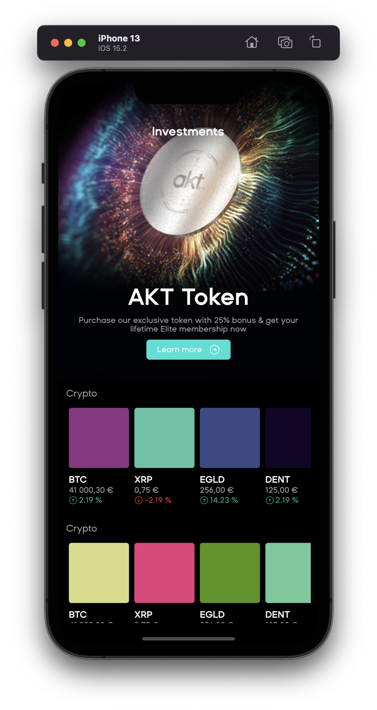

# AKT - Mobile

[]()

## Project

This project is a technical test for AKT company.
It aims to demonstrate my technical & architectural skills with the Flutter framework.



## Installing

1. Clone the repo

   ```sh
   https://github.com/tchowski/AKT_TECHNICAL_TEST.git
   ```

1. Run flutter pub get

   ```sh
   flutter pub get
   ```

1. IOS ONLY

   ```sh
   cd ios && pod install
   ```

## VScode snippets
Use snipets for MVC architecture

https://gist.github.com/tchowski/836763dd565008502cbf7fd953d49ab9

Add them to VScode under Settings > User Snippets > Dart. Paste them into the json file


## Start the application

You can use `settings.json` to configure you start running app and then press F5 to start your client with the environment that you want.

```sh
{
        {
            "name": "AKT - development",
            "request": "launch",
            "type": "dart",
            "program": "lib/main.dart",
        },
}
```

## Testing

1. Goldens tests

   ```sh
   ./launch_test.sh
   ```

# Architecture
MVC Architecture


## Style

[](https://github.com/tenhobi/effective_dart)

Effective Dart style: https://dart.dev/guides/language/effective-dart

## Contact

GitHub: [https://github.com/tchowski/AKT_TECHNICAL_TEST.git](https://github.com/tchowski/AKT_TECHNICAL_TEST.git)
